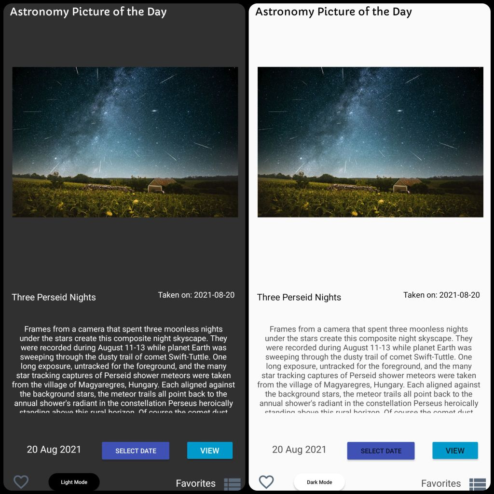
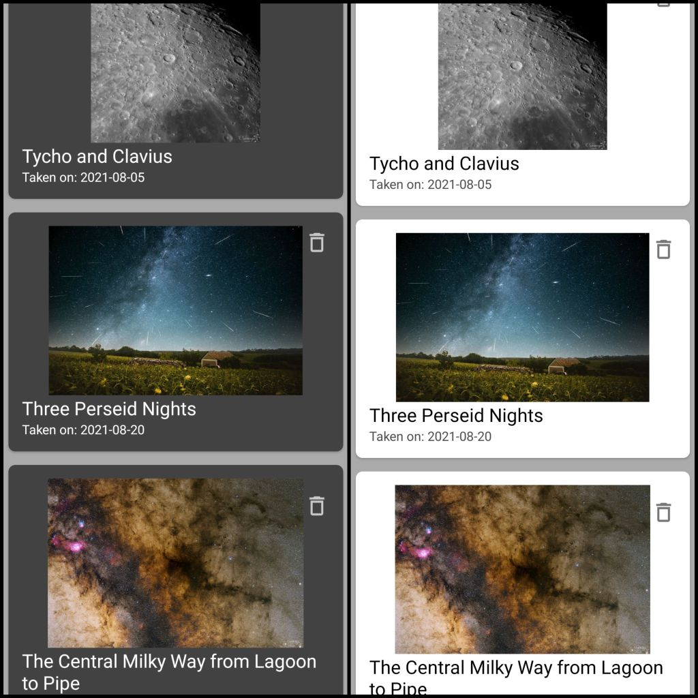
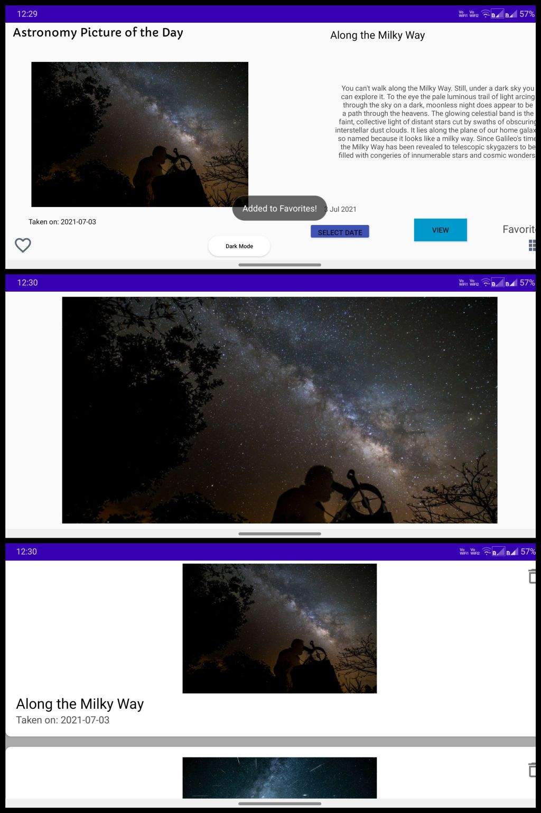
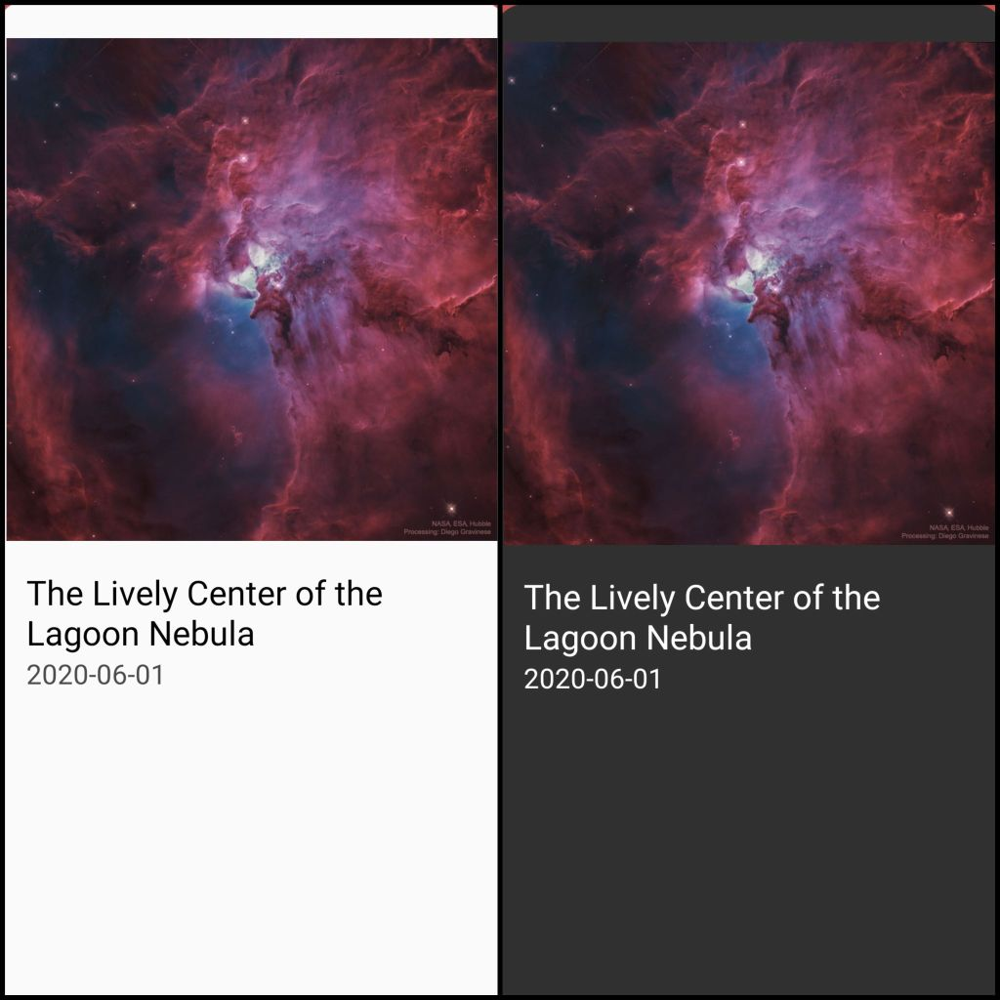
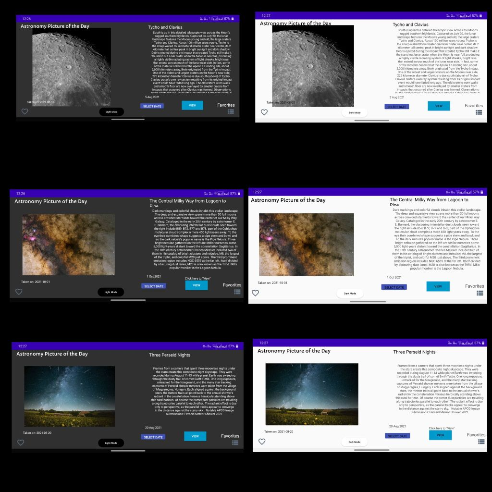

# Astronomy Picture of the Day
https://apod.nasa.gov/apod/astropix.html

## NASA APIs ##
This app generates requests based on NASA's APOD service:
https://api.nasa.gov/

### *Sign up for your API key at:* ###
https://api.nasa.gov/index.html#apply-for-an-api-key

### *An example query:* ###
https://api.nasa.gov/planetary/apod?api_key=DEMO_KEY

The DEMO_KEY should be changed at **line 64** of **MainActivity.java** *(mUrlRequestDefaultKey)*

## Download ##
Download it [here](https://raw.githubusercontent.com/PrasoonDhaneshwar/Astronomy-Photo-Of-The-Day-Android/main/Astronomy-Picture-of-the-Day-v1.0.apk) to run the application in your Android phone.

#### App Features: ####
- Allow users to search for the picture for a date of their choice
- Allow users to create/manage a list of "favorite" listings
- Display date, explanation, Title and the image / video of the day

#### Extras: ####
- Dark mode support
- Handling for different screen sizes and orientations.

## Screenshots ##
#### *Select any date and fetch it's corresponding picture information.* ####

#### *"Add" it to "Favorites" and save the list.* ####

#### *Support for Landscape orientation:* ####

#### *Detailed view of picture:* ####

#### *Support for orientation:* ####

#### Dependencies ####

- *[Volley](https://developer.android.com/training/volley*/).* An HTTP library that makes networking for Android apps easier.
- *[Picasso](https://square.github.io/picasso/).* A powerful image downloading and caching library for Android.
- *[Gson](https://github.com/google/gson).* Convert Java Objects into their JSON representation.

*Note: This app uses HTTP requests, and may return sometimes it may return a timeout. "View" again to make a request for metadata.*